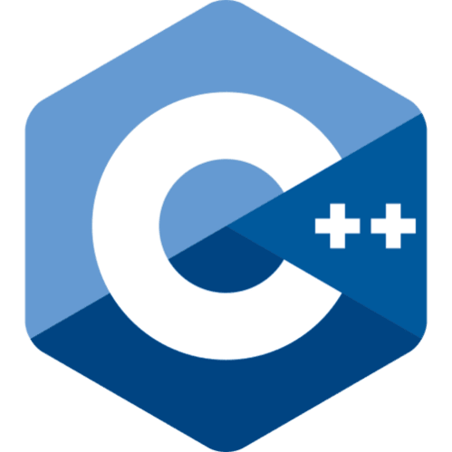
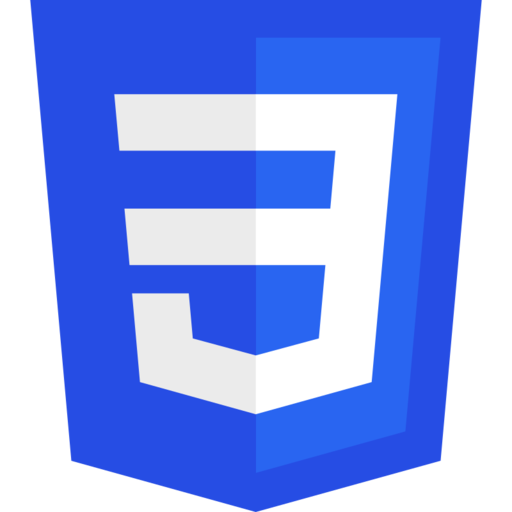

<link rel="stylesheet" href="index.css">

# Hello, I'm Victor Guidoni, I welcome you to my GitHub account

---

# Contact 😎🤘

>* ## email@ : guidonivictor3@gmail.com

>* ## GitHub :  https://github.com/Rotkiv97

---

# Worck Ambition

> ##  Game developer
> ##  Website developer
> ##  Developer augmented reality 
> ##  App developer

---

# Developer tools ⚒️

    
    
    
    
    
    

---

# Projects 🚀👽
#
# [CPP](https://github.com/Rotkiv97/CPP)
# [Libft](https://github.com/Rotkiv97/Libft)
# [Philosophers](https://github.com/Rotkiv97/Philosophers)
# [Inception](https://github.com/Rotkiv97/Inception)
# [IRC](https://github.com/Rotkiv97/IRC)
# [Minitalk](https://github.com/Rotkiv97/Minitalk)
# [So_long](https://github.com/Rotkiv97/So_long)
# [Get_Next_Line](https://github.com/Rotkiv97/Get_Next_Line)
# [Ft_printf](https://github.com/Rotkiv97/Ft_printf)

---

# Collaborative projects 🔎 💻 🔍
#
# [Minishell](https://github.com/Rotkiv97/minishell) in collaboration with [Coluyanson](https://github.com/Coluyanson)
# [Cube3D](https://github.com/Rotkiv97/cub3D) in collaboration with [Coluyanson](https://github.com/Coluyanson)

---

# Statistics

---

# Resolutions in the future 🪐 🔭
## Even though I haven't delivered C# projects on GitHub yet, I'm studying it with Unity, and will most likely also deliver many meshes with blender.
## While in HTML, CSS and JS I am carrying out a project that I will deliver soon in collaboration, and I think I will deliver many projects with these languages
