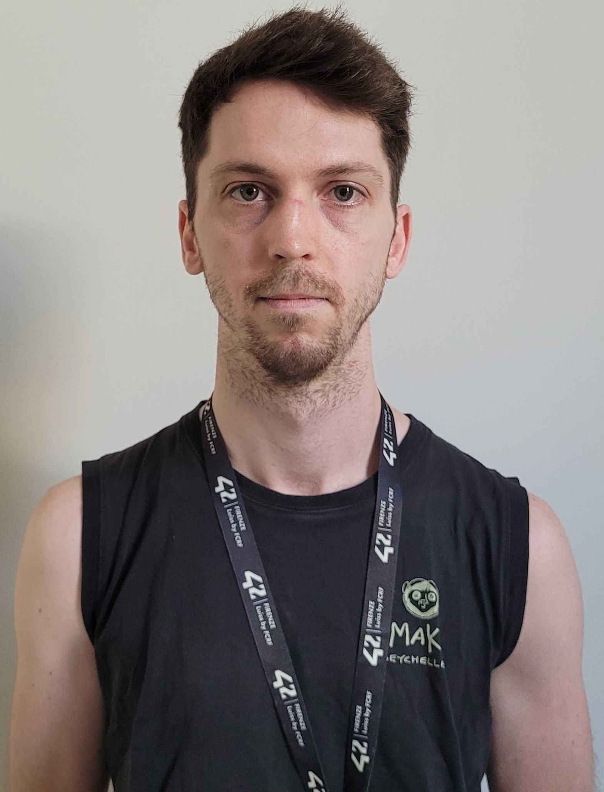

<link rel="stylesheet" href="index.css">

    

---
#
#
#

# Hello, I'm Victor Guidoni, I welcome you to my GitHub account

---

# Contact
#

>* ## email@ : guidonivictor3@gmail.com

>* ## GitHub :  https://github.com/Rotkiv97

---

#
#

# Lenguage

#
#

    
    
    
    
    
    

#
#
#
#
#

# Projects
#
# [CPP](https://github.com/Rotkiv97/CPP)
# [Libft](https://github.com/Rotkiv97/Libft)
# [Philosophers](https://github.com/Rotkiv97/Philosophers)
# [Inception](https://github.com/Rotkiv97/Inception)
# [IRC](https://github.com/Rotkiv97/IRC)
# [Minitalk](https://github.com/Rotkiv97/Minitalk)
# [So_long](https://github.com/Rotkiv97/So_long)
# [Get_Next_Line](https://github.com/Rotkiv97/Get_Next_Line)
# [Ft_printf](https://github.com/Rotkiv97/Ft_printf)

#

# Collaborative projects
#
# [Minishell](https://github.com/Rotkiv97/minishell) collaborazione con [Coluyanson](https://github.com/Coluyanson)
# [Cube3D](https://github.com/Rotkiv97/cub3D) collaborazione con [Coluyanson](https://github.com/Coluyanson)

